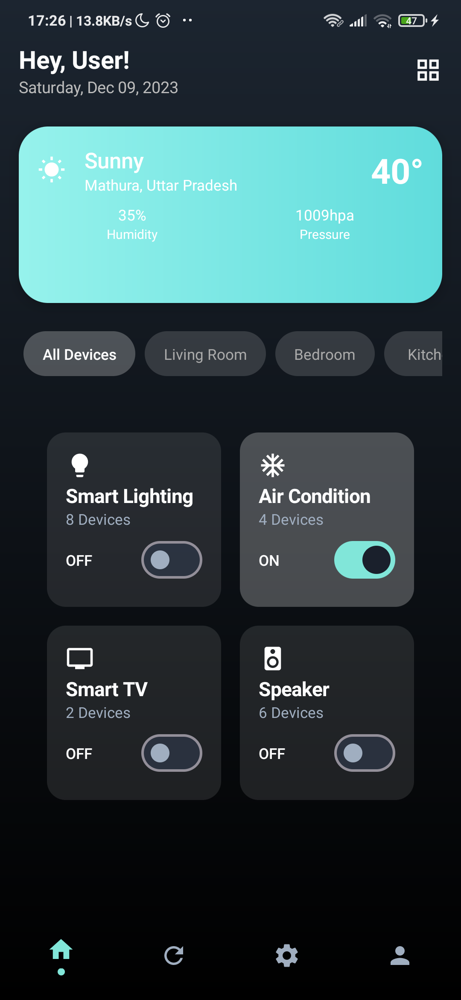
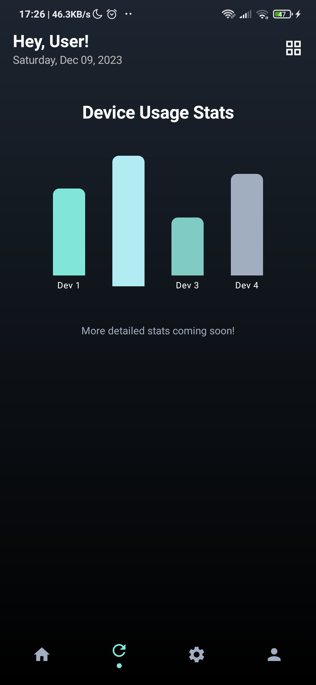
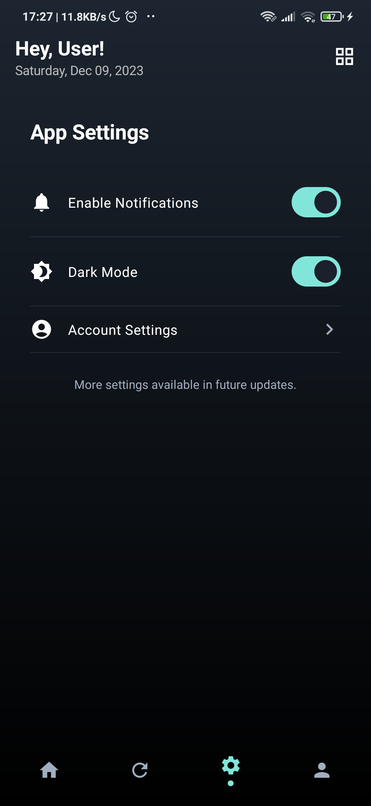
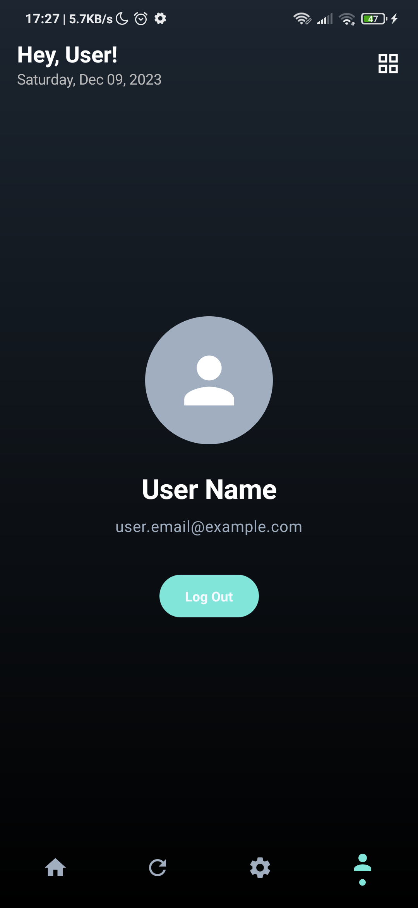

 
<!-- 
  TODO: For this logo to display correctly on GitHub/web, you should:
  1. Place your actual app logo (e.g., a PNG or SVG file, not an XML drawable) 
     in a suitable directory, for example, create an 'assets' folder in your project root 
     and put the logo there (e.g., 'assets/app_logo.png').
  2. Update the src path below to be relative to the README.md file (e.g., "assets/app_logo.png").
  The current path points to an XML drawable which won't render as an image on most Markdown viewers.
-->
 

<h1 align="center">Smart Home App</h1>
 

  
  
  
  
   
   

An intuitive Smart Home application built with modern Android technologies, allowing users to seamlessly control and monitor their smart devices.

## Key Features 🔥

1.  **Home Screen**: 
    *   Displays current weather information (e.g., temperature, conditions, humidity).
    *   Shows a grid of smart devices like Smart Lighting, Air Condition, Smart TV, and Speakers.
    *   Provides quick on/off toggle controls for each device.
    *   Features category tabs (All Devices, Living Room, Bedroom, Kitchen) for filtering devices (Note: Full filtering logic might be a future enhancement).
2.  **Stats Screen**: A dedicated section to display device usage statistics and insights (currently a placeholder).
3.  **Settings Screen**: Allows users to configure application preferences and settings (currently a placeholder).
4.  **Profile Screen**: Displays user-specific information and account details (currently a placeholder).
5.  **Splash Screen**: A welcoming screen that appears on app launch, providing a smooth entry into the application.
6.  **Dynamic Theming**: Utilizes a gradient background that adapts across the app for a consistent and modern look.

## Screenshots 📸

<table>
  <tr>
    <td valign="top"></td>
    <td valign="top"></td>
  </tr>
  <tr>
    <td valign="top"></td>
    <td valign="top"></td>
  </tr>
 </table>

## Technology Stack 🛠️

*   **Kotlin**: Primary programming language.
*   **Jetpack Compose**: For building the declarative UI.
*   **Material You**: For modern UI components and theming.
*   **Coroutines**: For asynchronous operations and managing background tasks (e.g., in splash screen).
*   **Android Architecture Components**: Utilized implicitly with Jetpack Compose (e.g., `ViewModel` if you were to add it, `Lifecycle`).

## TODO / Future Enhancements 🚀

*   Implement full functionality for Stats, Settings, and Profile screens.
*   Connect to actual smart home APIs or mock data sources.
*   Add device detail screens.
*   Implement theme switching (Light/Dark) if not fully dynamic yet.
*   Refine error handling and loading states. 